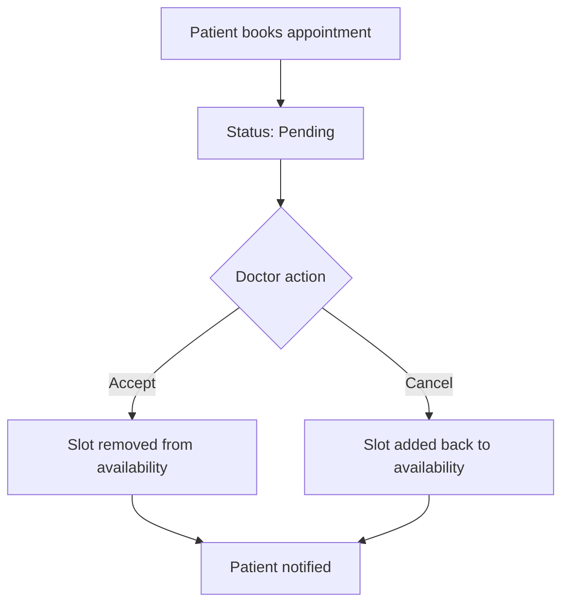

````markdown
# 🩺 Doctor–Patient Appointment Management System API

A RESTful API for managing doctor–patient appointments using **Node.js**, **Express.js**, **TypeScript**, and **MongoDB**. This system allows doctors to register and manage services and availability, while patients can browse doctors, view available time slots, and request appointments.

---

## ✅ Features

### 👨‍⚕️ Doctor Module

- Register/Login as Doctor
- Add/Edit/Delete Services
- Set Availability (days + time slots)
- View & Manage Appointments (Accept/Cancel/Complete)

### 👩‍⚕️ Patient Module

- Register/Login as Patient
- View Doctors, Filter by hospital/specialization/service
- View Doctor Details: Services, Availability, Hospital info
- Book Appointments
- Track Appointment Status (Pending, Accepted, Cancelled, Completed)

### 🔐 Authentication & Authorization

- JWT-based authentication
- Role-based Access Control (Doctor/Patient)
- Passwords are securely hashed using **bcryptjs**

---

## 🛠️ Technology Stack

- **Backend:** Node.js, Express.js, TypeScript
- **Database:** MongoDB, Mongoose
- **Auth:** JWT + bcryptjs
- **Validation:** Zod
- **Email:** Nodemailer (Mock email on status change)
- **Testing:** Jest, Supertest
- **Linting:** ESLint, Prettier

---

## 📦 API Endpoints

### Auth Routes

| Method | Endpoint               | Description           |
| ------ | ---------------------- | --------------------- |
| POST   | /auth/register-doctor  | Register as Doctor    |
| POST   | /auth/register-patient | Register as Patient   |
| POST   | /auth/login            | Login & get JWT Token |

### Doctor Routes

| Method | Endpoint                        | Description                 |
| ------ | ------------------------------- | --------------------------- |
| POST   | /doctor/services                | Add Service                 |
| PATCH  | /doctor/services/:id            | Edit Service                |
| DELETE | /doctor/services/:id            | Delete Service              |
| POST   | /doctor/availability            | Set Availability            |
| PATCH  | /doctor/appointments/:id/status | Accept/Cancel/Complete      |
| GET    | /doctor/appointments            | View Appointments by status |

### Patient Routes

| Method | Endpoint              | Description                       |
| ------ | --------------------- | --------------------------------- |
| GET    | /doctors              | Browse all Doctors (with filters) |
| GET    | /doctors/:id          | View Doctor Profile               |
| POST   | /appointments         | Book Appointment                  |
| GET    | /patient/appointments | View My Appointments              |

---

## 🗂️ Appointment Workflow


````

---

## 📁 Project Structure

```
/src
├── app/               # Express app configuration
├── modules/           # Feature modules
│   ├── auth/          # Authentication
│   ├── user/          # User models
│   ├── doctor/        # Doctor features
│   ├── patient/       # Patient features
│   ├── service/       # Service management
│   ├── hospital/      # Hospital management
│   ├── special../     # Specialization management
│   ├── appointment/   # Appointment logic
│   └── availability/  # Availability management
├── utils/             # Utility functions
├── middlewares/       # Custom middlewares
├── config/            # Configuration files
├── app.ts             # Main app file
└── server.ts          # Server entry point
```

---

## 🚀 Setup Instructions

### Prerequisites

- Node.js (v16+)
- MongoDB (v4.4+)
- TypeScript (v4.7+)

### 1. Clone the Repository

```bash
git clone https://github.com/hammadsadi/dr-tech-backend.git
cd dr-tech-backend
```

### 2. Install Dependencies

```bash
yarn install
```

### 3. Configure Environment

Create `.env` file:

```bash
cp .env.example .env
```

Then update with your credentials.

### 4. Run the Server

```bash
# Development
yarn dev

# Production build
yarn build
```

---

## 📬 API Usage Documentation

[Download Postman Collection](./postman_collection.json) (Update with actual link)

---

## 📘 API Usage

### 🔐 Auth Routes

#### ➕ Register Doctor

**POST** `/auth/register-doctor`
`Example Request Body`

```json
{
  "name": "Dr. Hammad",
  "email": "hammad@dr.com",
  "phone": "01700000000",
  "password": "123456",
  "specialization": "68604362312dd12064c022ac", // ObjectId from Specialization collection
  "hospitalName": "68604380312dd12064c022af" // ObjectId from Hospital collection
}
```

Returns: `{ "token": "JWT_TOKEN_HERE" }`

#### ➕ Register Patient

**POST** `/auth/register-patient`
`Example Request Body`

```json
{
  "name": "John Doe",
  "email": "john@example.com",
  "phone": "01800000000",
  "password": "123456",
  "age": 30,
  "gender": "Male"
}
```

Returns: `{ "token": "JWT_TOKEN_HERE" }`

#### 🔑 Login

**POST** `/auth/login`
`Example Request Body`

```json
{
  "email": "john@example.com",
  "password": "123456"
}
```

Returns: `{ "token": "JWT_TOKEN_HERE" }`

---

### 🩺 Doctor Routes

#### ➕ Add Service

**POST** `/doctor/services`

**Headers:**

```json
Authorization: DOCTOR_JWT_TOKEN
```

**Body:** `Example Request Body`

```json
{
  "title": "Heart Checkup",
  "description": "Basic heart checkup",
  "price": 800,
  "duration": 30
}
```

#### 📅 Set Availability

**POST** `/doctor/availability`
`Example Request Body`

```json
{
  "service": "SERVICE_ID", // ObjectId from Service collection
  "day": "Monday",
  "slots": ["10:00 AM", "11:00 AM", "2:00 PM"]
}
```

#### 🗂 View Appointments by Status

**GET** `/doctor/appointments?status=pending`

#### ✅ Update Appointment Status

**PATCH** `/doctor/appointments/:id/status`
`Example Request Body`

```json
{
  "status": "accepted"
}
```

---

### 👤 Patient Routes

#### 📋 View All Doctors

**GET** `/doctor`

Optional Filters:

- `?hospitalName.name=City Hospital`
- `?specialization.name=Cardiology`

#### 👀 View Doctor Profile

**GET** `/doctor/:id`

#### 📆 Book Appointment

**POST** `/appointments`
**Headers:**

```json
Authorization: PATIENT_JWT_TOKEN
```

`Example Request Body`

```json
{
  "doctorId": "DOCTOR_ID", // Doctor ObjectId
  "serviceId": "SERVICE_ID", // Service ObjectId
  "selectedDate": "2025-06-30",
  "timeSlot": "10:00 AM"
}
```

#### 🧾 View My Appointments

**GET** `/patient/appointment`
**Headers:**

```json
Authorization: PATIENT_JWT_TOKEN
```

---

## ✨ Author

**Hammad Sadi**  
📧 Email: [shahisrail134@gmail.com](mailto:shahisrail134@gmail.com)  
🔗 GitHub: [@yourusername](https://github.com/yourusername)
